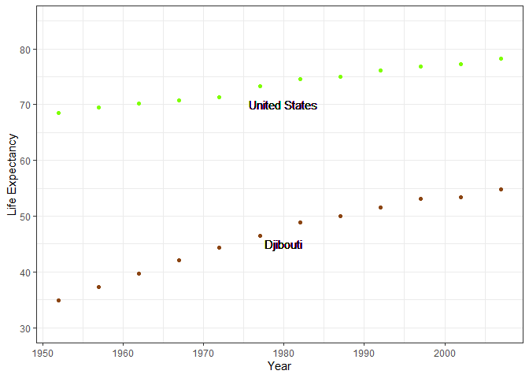

#load libraries


# HW 4 Objective
You have learned alot about data wrangling! You know how to use the tidyverse to:

  * Filter rows and select variables in a principled or name-based manner
  * Modify variables and create new variables
  * Group rows of a data frame and do summarizing or mutating computations within group
  * Reshape a data frame
  * Get new information into a data frame via a joining
  * The goal of this homework is to solidify your data wrangling skills by working
  some realistic problems in the grey area between data aggregation and data
  reshaping.

If you internalize that there are multiple solutions to most problems, you will spend less time banging your head against the wall in data analysis. If something’s really hard, sneak up on it from a different angle.


# Excercise 1:

## Univariate Option 1

##### Make a tibble with one row per year, and columns for life expectancy for two or more countries. Take advantage of this new data shape to scatterplot life expectancy for one country against that of another. Re-lengthen the data.

**I made a wide dataset for United States and Djibouti**


```text
wide <- gapminder %>% 
  select(year, country, lifeExp) %>% 
  filter(country %in% c("United States", "Djibouti")) %>%
  pivot_wider(id_cols = year,
              names_from = country,
              values_from = lifeExp)
wide
```

```
## # A tibble: 12 x 3
##     year Djibouti `United States`
##    <int>    <dbl>           <dbl>
##  1  1952     34.8            68.4
##  2  1957     37.3            69.5
##  3  1962     39.7            70.2
##  4  1967     42.1            70.8
##  5  1972     44.4            71.3
##  6  1977     46.5            73.4
##  7  1982     48.8            74.6
##  8  1987     50.0            75.0
##  9  1992     51.6            76.1
## 10  1997     53.2            76.8
## 11  2002     53.4            77.3
## 12  2007     54.8            78.2
```


**I made a scatterplot comparing the life expectancy of US and Djibouti over time**

```text
wide %>%
ggplot() +
  geom_point(aes(x = year, y = `United States`), col = "chartreuse") +
  geom_text(x=1980, y=70, label="United States") +
  geom_point(aes(x = year, y = Djibouti), col = "chocolate4") +
  geom_text(x=1980, y=45, label="Djibouti") +
  theme_bw() +
  ylim(30, 85)+
  ylab("Life Expectancy")+
  xlab("Year")
```




**Putting data back into long format**

```text
wide %>% 
  pivot_longer(cols = c(`United States`, Djibouti),
               names_to  = "Country",
               values_to = "Life_Expectancy") 
```

```
## # A tibble: 24 x 3
##     year Country       Life_Expectancy
##    <int> <chr>                   <dbl>
##  1  1952 United States            68.4
##  2  1952 Djibouti                 34.8
##  3  1957 United States            69.5
##  4  1957 Djibouti                 37.3
##  5  1962 United States            70.2
##  6  1962 Djibouti                 39.7
##  7  1967 United States            70.8
##  8  1967 Djibouti                 42.1
##  9  1972 United States            71.3
## 10  1972 Djibouti                 44.4
## # ... with 14 more rows
```


<br><br><br>


***


<br><br><br>


# Exercise 2:

## Multivariate Option 1

##### Make a tibble with one row per year, and columns for life expectancy and GDP per capita for two or more countries. Print this table in a pretty format, using either knitr::kable() or DT::datatable() depending on the number of rows of data. Re-lengthen the data.

<br>

**I made a wide dataset for Cuba and Jamaica**

```text
wide2 <- gapminder %>%
  select(year, country, lifeExp, gdpPercap) %>% 
  filter(country %in% c("Cuba", "Jamaica")) %>%
  pivot_wider(id_cols = year,
              names_from = c(country),
              names_sep = "_",
              values_from = c(lifeExp, gdpPercap)) 

wide2
```

```
## # A tibble: 12 x 5
##     year lifeExp_Cuba lifeExp_Jamaica gdpPercap_Cuba gdpPercap_Jamaica
##    <int>        <dbl>           <dbl>          <dbl>             <dbl>
##  1  1952         59.4            58.5          5587.             2899.
##  2  1957         62.3            62.6          6092.             4757.
##  3  1962         65.2            65.6          5181.             5246.
##  4  1967         68.3            67.5          5690.             6125.
##  5  1972         70.7            69            5305.             7434.
##  6  1977         72.6            70.1          6380.             6650.
##  7  1982         73.7            71.2          7317.             6068.
##  8  1987         74.2            71.8          7533.             6351.
##  9  1992         74.4            71.8          5593.             7405.
## 10  1997         76.2            72.3          5432.             7122.
## 11  2002         77.2            72.0          6341.             6995.
## 12  2007         78.3            72.6          8948.             7321.
```


```text
knitr::kable(wide2)
```


 year   lifeExp_Cuba   lifeExp_Jamaica   gdpPercap_Cuba   gdpPercap_Jamaica
-----  -------------  ----------------  ---------------  ------------------
 1952         59.421            58.530         5586.539            2898.531
 1957         62.325            62.610         6092.174            4756.526
 1962         65.246            65.610         5180.756            5246.108
 1967         68.290            67.510         5690.268            6124.703
 1972         70.723            69.000         5305.445            7433.889
 1977         72.649            70.110         6380.495            6650.196
 1982         73.717            71.210         7316.918            6068.051
 1987         74.174            71.770         7532.925            6351.237
 1992         74.414            71.766         5592.844            7404.924
 1997         76.151            72.262         5431.990            7121.925
 2002         77.158            72.047         6340.647            6994.775
 2007         78.273            72.567         8948.103            7320.880

**Putting data back into long format**

```text
(wide2 %>% 
pivot_longer(cols= c(starts_with("lifeExp"), starts_with("gdpPercap")),
               names_to  = c(".value","Country"),
              names_sep="_")) 
```

```
## # A tibble: 24 x 4
##     year Country lifeExp gdpPercap
##    <int> <chr>     <dbl>     <dbl>
##  1  1952 Cuba       59.4     5587.
##  2  1952 Jamaica    58.5     2899.
##  3  1957 Cuba       62.3     6092.
##  4  1957 Jamaica    62.6     4757.
##  5  1962 Cuba       65.2     5181.
##  6  1962 Jamaica    65.6     5246.
##  7  1967 Cuba       68.3     5690.
##  8  1967 Jamaica    67.5     6125.
##  9  1972 Cuba       70.7     5305.
## 10  1972 Jamaica    69       7434.
## # ... with 14 more rows
```


<br><br><br>


***


<br><br><br>


# Exercise 3: Table Joins 

##### Read in the made-up wedding guestlist and email addresses using the following lines (go ahead and copy-paste these). Then, complete the following tasks using the tidyverse (tidyr, dplyr, …). There shouldn’t be any need to do any pivoting – feel free to leave guest in its current format.

```text
guest <- read_csv("https://raw.githubusercontent.com/USF-Psych-DataSci/Classroom/master/data/wedding/attend.csv")
email <- read_csv("https://raw.githubusercontent.com/USF-Psych-DataSci/Classroom/master/data/wedding/emails.csv")
```


## 3.1:

##### For each guest in the guestlist (guest tibble), add a column for email address, which can be found in the email tibble.


```text
email_name <- email %>% 
  separate_rows(guest, sep = ", ") %>%
  rename(name = guest)
email_name
```

```
## # A tibble: 28 x 2
##    name            email              
##    <chr>           <chr>              
##  1 Sommer Medrano  sommm@gmail.com    
##  2 Phillip Medrano sommm@gmail.com    
##  3 Blanka Medrano  sommm@gmail.com    
##  4 Emaan Medrano   sommm@gmail.com    
##  5 Blair Park      bpark@gmail.com    
##  6 Nigel Webb      bpark@gmail.com    
##  7 Sinead English  singlish@hotmail.ca
##  8 Ayra Marks      marksa42@gmail.com 
##  9 Jolene Welsh    jw1987@hotmail.com 
## 10 Hayley Booker   jw1987@hotmail.com 
## # ... with 18 more rows
```

```text
email_name %>% 
  separate(name, into = c("First", "Last"))
```

```
## # A tibble: 28 x 3
##    First   Last    email              
##    <chr>   <chr>   <chr>              
##  1 Sommer  Medrano sommm@gmail.com    
##  2 Phillip Medrano sommm@gmail.com    
##  3 Blanka  Medrano sommm@gmail.com    
##  4 Emaan   Medrano sommm@gmail.com    
##  5 Blair   Park    bpark@gmail.com    
##  6 Nigel   Webb    bpark@gmail.com    
##  7 Sinead  English singlish@hotmail.ca
##  8 Ayra    Marks   marksa42@gmail.com 
##  9 Jolene  Welsh   jw1987@hotmail.com 
## 10 Hayley  Booker  jw1987@hotmail.com 
## # ... with 18 more rows
```

```text
left_join(guest, email_name, by = "name") %>% 
  select(party, name, email, everything())
```

```
## # A tibble: 30 x 8
##    party name  email meal_wedding meal_brunch attendance_wedd~
##    <dbl> <chr> <chr> <chr>        <chr>       <chr>           
##  1     1 Somm~ somm~ PENDING      PENDING     PENDING         
##  2     1 Phil~ somm~ vegetarian   Menu C      CONFIRMED       
##  3     1 Blan~ somm~ chicken      Menu A      CONFIRMED       
##  4     1 Emaa~ somm~ PENDING      PENDING     PENDING         
##  5     2 Blai~ bpar~ chicken      Menu C      CONFIRMED       
##  6     2 Nige~ bpar~ <NA>         <NA>        CANCELLED       
##  7     3 Sine~ sing~ PENDING      PENDING     PENDING         
##  8     4 Ayra~ mark~ vegetarian   Menu B      PENDING         
##  9     5 Atla~ <NA>  PENDING      PENDING     PENDING         
## 10     5 Denz~ <NA>  fish         Menu B      CONFIRMED       
## # ... with 20 more rows, and 2 more variables: attendance_brunch <chr>,
## #   attendance_golf <chr>
```


## 3.2

##### Who do we have emails for, yet are not on the guestlist?


```text
anti_join(email_name, guest, by = "name")
```

```
## # A tibble: 3 x 2
##   name            email                          
##   <chr>           <chr>                          
## 1 Turner Jones    tjjones12@hotmail.ca           
## 2 Albert Marshall themarshallfamily1234@gmail.com
## 3 Vivian Marshall themarshallfamily1234@gmail.com
```
Turner Jones, Albert Marshall, and Vivian Marshall


## 3.3 

##### Make a guestlist that includes everyone we have emails for (in addition to those on the original guestlist).


```text
guest %>% 
  full_join(email_name, by = "name") %>% 
  select(name, email)
```

```
## # A tibble: 33 x 2
##    name             email              
##    <chr>            <chr>              
##  1 Sommer Medrano   sommm@gmail.com    
##  2 Phillip Medrano  sommm@gmail.com    
##  3 Blanka Medrano   sommm@gmail.com    
##  4 Emaan Medrano    sommm@gmail.com    
##  5 Blair Park       bpark@gmail.com    
##  6 Nigel Webb       bpark@gmail.com    
##  7 Sinead English   singlish@hotmail.ca
##  8 Ayra Marks       marksa42@gmail.com 
##  9 Atlanta Connolly <NA>               
## 10 Denzel Connolly  <NA>               
## # ... with 23 more rows
```

